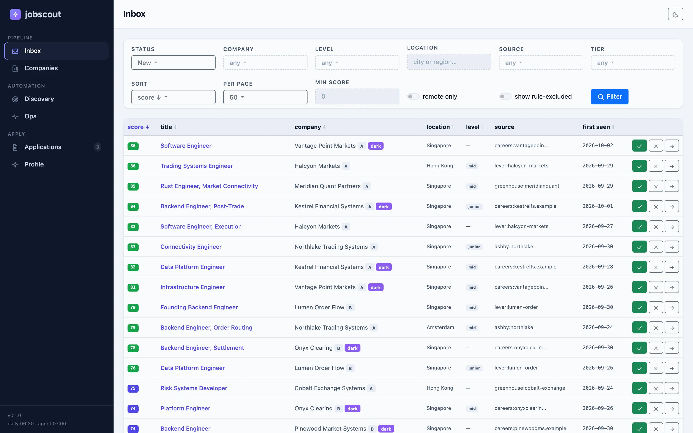
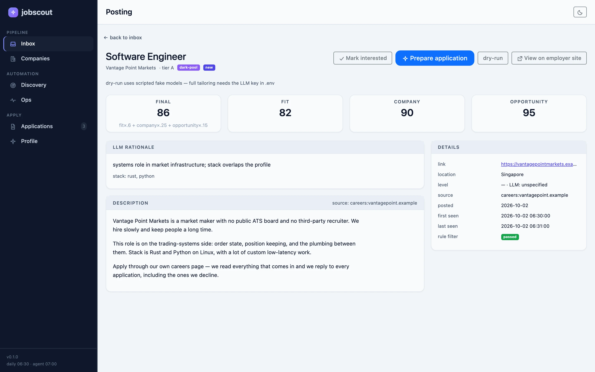
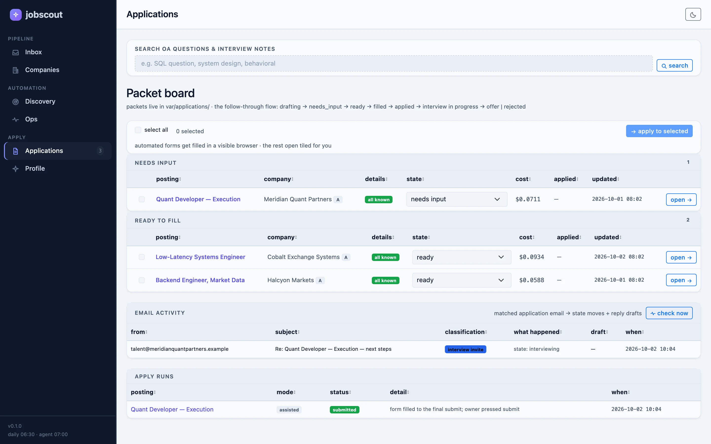
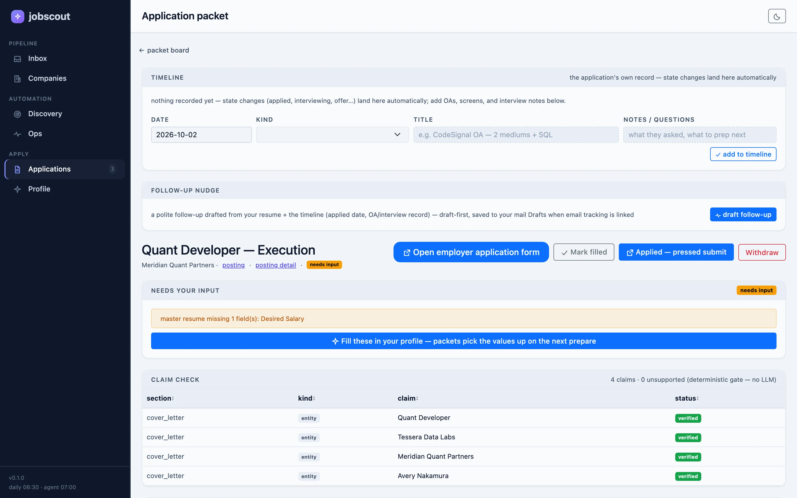
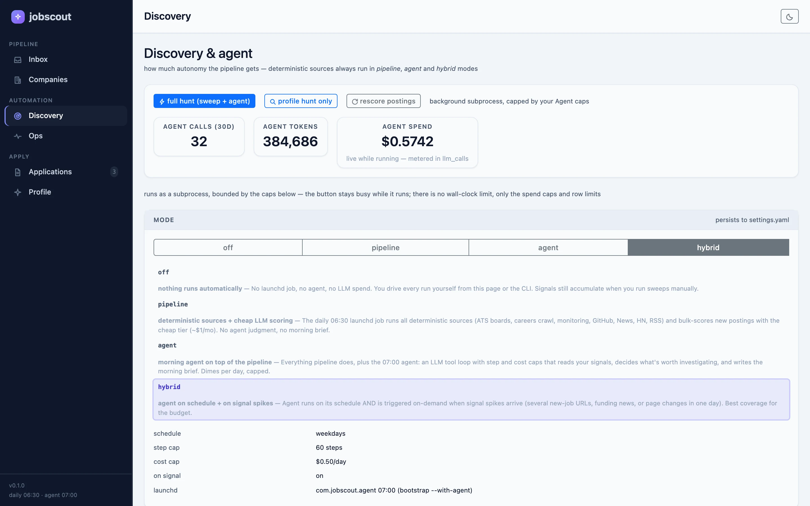
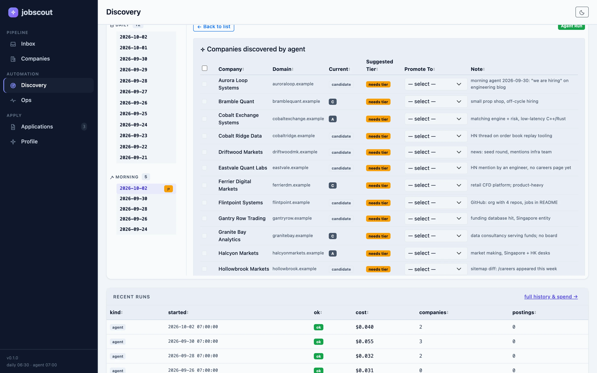
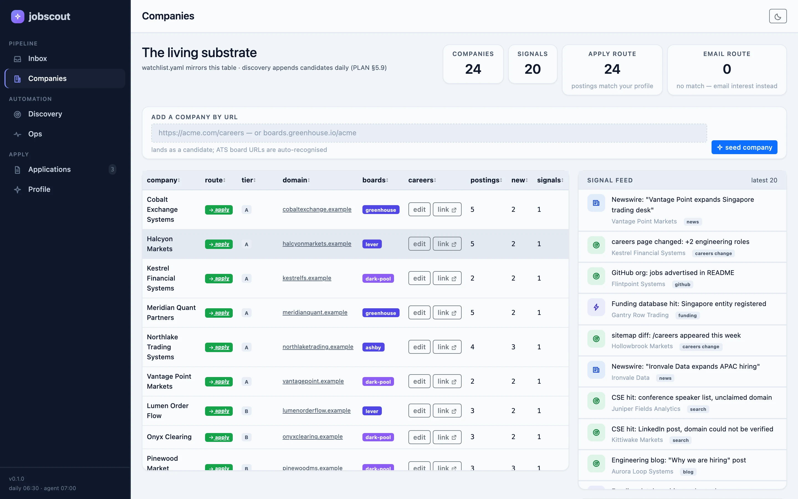
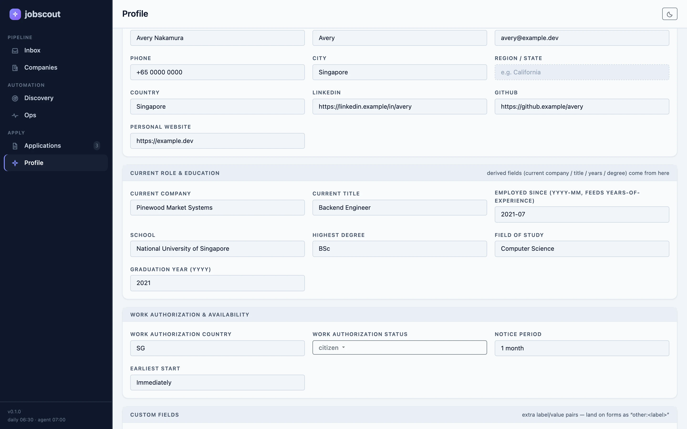

# jobscout

> [!IMPORTANT]
> **Roughly 99% of this code was written by AI, in a hurry, for one person's
> own use.**
>
> It was imagined and built quickly with AI to try out an idea and then
> actually put it to work — my own job search. It is not a mature product and
> it was never polished as one. Please read the code with that in mind: expect
> rough edges, uneven conventions, and the occasional confident mistake.
>
> That said — you are very welcome to use it. The UI is the part that should
> hold up. If any of this is useful to you, take it.

Cost-effective daily AI job-hunt pipeline. An agent-driven discovery layer (switchable),
a free deterministic collection layer, cheap cached LLM scoring, and grounded
application packets built entirely from a single master resume.

**Read [PLAN.md](PLAN.md) first** — it is the single source of truth for design
and progress. [AGENTS.md](AGENTS.md) covers conventions for coding agents.
Each package directory carries its own `README.md` explaining how it works.



## The loop (what the system does)

```
watchlist (companies you care about, with ATS board tokens)
   │
   ▼
sources/postings  ── polls ATS boards + crawls dark-pool careers pages,
                    searches job sites (MyCareersFuture public API +
                    the JobPilot sidecar: LinkedIn, Indeed, YC, Wellfound)
                                                          ──▶ postings
sources/discovery ── signals + new-company discovery (news, HN, github,
                    funding, page changes, CSE searches)      ──▶ signals + candidates
   │
   ▼
scoring/rules ── the deterministic gate (your hunting profile:
                 roles, levels, locations, dealbreakers)
scoring/llm_bulk ── cheap cached scoring of rule-passed postings
   │
   ▼
inbox (the dashboard) ── you mark postings interested
   │
   ▼
packets/orchestrator ── builds the application packet: fill sheet from
   the master resume, tailored resume, claim-checked cover letter, PDF
   │
   ▼
webapp/runners/apply ── launch: automated (JobPilot fillers, headed
   browser, tiled windows) or assisted (browser opened at the form)
```

The **agent** (`agent/`) sits above the sources: a morning LLM tool-loop that
reads the brief (your hunting profile + today's signals + caps), does real web
searches (4 selectable engines), adds candidate companies to the watchlist,
records signals, and writes research notes + the morning report.

## Walkthrough

Two clips of the dashboard. Both are recorded against a **synthetic demo
dataset** — a fictional company graph and a fictional candidate — so nothing
private is in them. Rebuild it any time with
`scripts/demo_seed.py` (see [Regenerating the assets](#regenerating-the-assets)).

### 1 · Inbox → posting → application packet

The core loop. Filter the scored inbox down to what you actually want, mark a
posting interested, and open the packet the quality tier built from your master
resume — fill sheet, tailored resume, claim-checked cover letter, all in one
page. The **claim-check gate** at the bottom is deterministic: every generated
claim is matched back to a bullet ID in `master_resume/`, and anything
unsupported stops the packet reaching `ready`.

[inbox-to-packet.mp4](https://github.com/RyanTYT/jobscout/releases/download/v0.1.0/inbox-to-packet.mp4)

<details>
<summary>GIF preview (1.3 MB)</summary>


</details>

### 2 · Discovery, the agent, and the dark pool

The mode switch decides how much autonomy the pipeline gets. On `hybrid`, the
free deterministic sweep always runs and the 07:00 agent rides on top of it
with step and cost caps — it reads the day's signals, decides what is worth
searching, and writes the morning report. Companies it finds come with the
evidence that justified them, and promoting one is a single dropdown. Watch the
`dark-pool` badge: a firm with a careers page and hiring news but **no ATS
board**, so no job board will ever list them.

[discovery-and-dark-pool.mp4](https://github.com/RyanTYT/jobscout/releases/download/v0.1.0/discovery-and-dark-pool.mp4)

<details>
<summary>GIF preview (1.2 MB)</summary>


</details>

## The pages

| | |
|---|---|
| **Inbox** — every rule-passed posting, scored. `fit×.6 + company×.25 + opportunity×.15`, server-side pagination, and a full filter panel over *all* postings. |  |
| **Posting** — the score breakdown, the rule-gate verdict, and the source it came from. |  |
| **Packet board** — one card per stage: drafting → needs input → ready to fill → filled → applied → interviewing → offer/rejected. |  |
| **Application packet** — fill sheet, tailored resume, cover letter, and the claim-check table. |  |
| **Discovery** — the `off/pipeline/agent/hybrid` switch, agent caps, and live 30-day agent spend. |  |
| **Morning report** — what the agent found, with evidence, and a promote-to-tier control per company. |  |
| **Companies** — the living substrate: ATS boards where they exist, the dark pool where they do not, plus the signal feed. |  |
| **Profile** — the master resume as a form. Everything downstream is generated from these fields and nothing else. |  |
| **Ops** — run history, per-tier model pricing with daily caps, and the sweep's source health. |  |

## The layout (one job per area)

```
jobscout/                 the pipeline package (cli.py is the only root module)
  core/                   kernel: paths · config · schema · db · resume · watchlist
  sources/postings/       ATS boards + dark-pool careers + job-site search → postings
  sources/discovery/      signal + company discovery (cse, github, hn, news, rss, monitoring)
  scoring/                gates: rules (deterministic) + llm_bulk (cheap tier)
  agent/                  judgment: brief · harness (tool loop) · tools
  packets/                applications: field_map · tailor · cover_letter · claim_check · render
  clients/                external service clients: llm · sidecar (JobPilot)
  ops/                    operational verbs: run · digest · doctor
  webapp/                 dashboard: routers/ (per page area) · stores/ (config
                          editors on one engine) · runners/ (agent hunts, applies)
config/ master_resume/    inputs (user-editable; shipped in the dmg)
var/                      ALL runtime outputs: data · digest · logs · morning_reports · research · applications
desktop/                  the Tauri shell + PyInstaller freeze (see desktop/README.md)
tests/                    conftest + one file per area
```

The package map in `jobscout/__init__.py` carries the same story inline.

## The config files (all inputs, all editable on the frontend)

| File | Holds | Frontend |
|---|---|---|
| `config/settings.yaml` | discovery mode (off/pipeline/agent/hybrid), agent caps (steps, $/run, schedule), search engine selection | Discovery + Ops pages |
| `config/profile.yaml` | the hunting profile (roles, levels, locations, stack) + scoring rubric + dealbreakers | Discovery page (Hunting profile card) |
| `config/models.yaml` | per-tier model slugs + prices + spend caps | Ops page (Models & pricing, with provider price refresh) |
| `config/watchlist.yaml` | the company substrate: A/B/C tiers, candidates, ATS tokens, notes | Companies page (editor + seed-by-URL) |
| `master_resume/resume.yaml` | the single source of truth for every application field | Profile page (form + full YAML upload/download) |
| `.env` | LLM key, CSE/Brave search keys (gitignored — the only secret store) | Ops page (credentials cards) |

## The three tiers (cost model)

| Tier | What | Cost |
|---|---|---|
| 0 | deterministic collectors (ATS JSON APIs, crawls, RSS, job-site search — MCF's public API + the Playwright sidecar for the bot-walled boards) | $0 |
| 1 | cheap LLM bulk scoring (cached by content hash) | pennies/day |
| 2 | full agent morning discovery (behind the mode switch) | dimes/day, capped |
| 3 | quality LLM packet tailoring (only postings you select) | ~$0.05–0.15 each |

## Build from source (dev)

Requirements: Python ≥ 3.11, Node ≥ 18 (desktop + JobPilot), Rust
(`rustup`, for the Tauri shell), optionally `typst` for PDFs
(`brew install typst`). For the bot-walled job sites (LinkedIn, Indeed,
YC, Wellfound) the JobPilot sidecar also needs the sibling repo built
(see below) — without it the sweep degrades to the plain-API sites
(MyCareersFuture).

```bash
python3 -m venv .venv
.venv/bin/pip install -e ".[all]"          # app + web + dev deps
.venv/bin/pip install pyinstaller          # for release builds
.venv/bin/jobscout db init                 # database (var/data/)
.venv/bin/jobscout doctor                  # health check
.venv/bin/jobscout serve --port 8799       # dashboard at http://127.0.0.1:8799
```

Tests: `.venv/bin/pytest tests/` (370 tests; fakes only — no network, no
browser launches, no LLM calls).

### Regenerating the assets

The screenshots in `docs/screenshots/` are captured from a throwaway runtime,
never from a real job hunt. `scripts/demo_seed.py` builds that runtime in one
command — it lives under `--home` and is reached only via `JOBSCOUT_HOME`, so your `config/`,
`master_resume/` and `var/` are never touched:

```bash
.venv/bin/python scripts/demo_seed.py --home /tmp/jobscout-demo --fresh
JOBSCOUT_HOME=/tmp/jobscout-demo .venv/bin/jobscout serve --port 8801
```

Then screenshot the running dashboard and convert to WebP:

```bash
ffmpeg -i shot.png -c:v libwebp -quality 88 -compression_level 6 shot.webp
```

The seeder deliberately routes everything through the real code so the demo
cannot drift from the product: scores come from
`scoring.llm_bulk.compute_final`, the claim-check table is produced by
`packets.claim_check.check_packet` and each packet's status is derived from
that gate's own verdict, and the reports are written in the shapes
`webapp.reports` actually reads. No network access.

**The two walkthrough clips are not in this repo.** They live as assets on the
[`v0.1.0` release](https://github.com/RyanTYT/jobscout/releases/tag/v0.1.0)
(≈3.7 MB of MP4 + GIF) so that regenerating them never touches git history —
the demo data is full of dates, so every refresh would otherwise pile another
few MB of near-identical video onto the log. The README links to that tag, so
it keeps working as the files are replaced; just don't rename or delete the
tag. To swap them in:

```bash
gh release upload v0.1.0 inbox-to-packet.mp4 --clobber
```

Screenshots stay in the repo deliberately — they are small, they are what
people actually see inline, and relative paths keep working in a clone.

## Build the desktop app (release)

```bash
cd desktop
npm install
npm run dev              # dev: repo backend + webview window
npm run build:release    # freeze + bundle → jobscout.app + jobscout_*.dmg (~2 min)
```

`build:release` snapshots your live `config/` + `master_resume/` into the
bundle (the dmg ships your current setup), freezes the Python backend with
PyInstaller, and builds the Tauri shell. Full story + copying to another
Mac: [desktop/README.md](desktop/README.md).

## Deploy (target Mac only — never the dev Mac)

```bash
./bootstrap.sh --dry-run           # see what it would do
./bootstrap.sh --with-agent --with-dashboard
```

Or just AirDrop the built dmg — self-contained, seeds its own runtime on
first launch at `~/Library/Application Support/com.jobscout.desktop/`.

## CLI reference

```
jobscout run [--daily] [--force]   the sweep: postings + signals + scoring
jobscout agent [--morning]         the agent tool-loop (needs LLM key)
jobscout add-company NAME --domain d [--tier B]   seed the watchlist (probes ATS)
jobscout probe --domain d          probe a domain for ATS boards
jobscout digest [--today]          show the latest morning digest
jobscout score / stats / prepare / mark / scan-form / fill / retro
jobscout init-home                 bootstrap a relocated runtime (packaged app)
jobscout serve [--port N]          the dashboard
jobscout db init|status            database lifecycle
jobscout config check|show         config validation
jobscout resume validate|fields    master resume checks
jobscout doctor                    whole-stack health check
```

## Environment variables

| Variable | Effect |
|---|---|
| `JOBSCOUT_HOME` | relocates the ENTIRE runtime (the packaged app sets it) |
| `JOBSCOUT_BIN` / `JOBSCOUT_NODE_BIN` / `JOBSCOUT_SIDECAR_BIN` | override binary resolution (bundled sidecar) |
| `JOBSCOUT_AGENT_FOCUS` | `profile` = agent spends its whole budget on profile-driven employer discovery |

Sibling repo `../JobPilot` (Node/Playwright sidecar) is the "hands" — spawned as
a subprocess, no rewrite. It powers two optional paths: the automated apply
fillers (without it: assisted mode, browser opened at the form) and the
bot-walled job-site scrapers — LinkedIn/Indeed/YC/Wellfound via Playwright
(Indeed launches your real Chrome; YC is a plain fetch). Without it the daily
sweep still runs: MyCareersFuture's public API + the ATS boards + the
discovery sources. Build it once: `cd ../JobPilot/scraper && npm install &&
npm run build-internal` (plus `npx playwright install chromium`).
